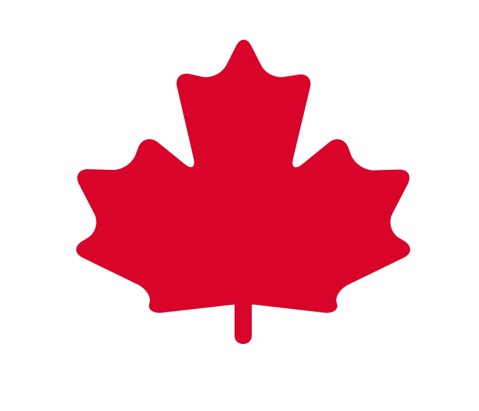

# Memory Cards: Canada Edition

    

[Play live version on GitHub Pages](https://kathyavini.github.io/canada-memory/)

A mobile-responsive memory card game I wrote to mark the occasion of submitting my application for Canadian PR.

------------------

## How to Play

Click or tap on each Canadian city or territory once and only once to win. Choosing the same card twice resets your score to 0. There are 17 Canada Cards in total.

On desktop you can hover each card to get the location name. On mobile, long press to reveal.

------------------

## About this project

### Built with
- React.js

### Assignment Description

This project is from The Odin Project fullstack JavaScript curriculum. You can find a full task description of [Memory Card](https://www.theodinproject.com/lessons/node-path-javascript-memory-card) on the TOP Website.

------------------

## Acknowledgments
### Packages
- [react-confetti](https://github.com/alampros/react-confetti)
- [react-rewards](https://github.com/thedevelobear/react-rewards)

### Attributions - Icons
- Maple leaf by [Emily Keller](https://thenounproject.com/emilykeller/) from NounProject.com
- Map of Canada by [Johann Berger](https://thenounproject.com/Yb/) from NounProject.com

### Attributions - Photographs
- Calgary by [Nataliia Kvitovska](https://unsplash.com/@nkvitovska) on [Unsplash](https://unsplash.com/photos/XQFQIutdIq8)
- Charlottetown by [M.](https://unsplash.com/@mkdrone_) on [Unplash](https://unsplash.com/photos/ZbXuMe2EyD4)
- Edmonton by [Chong Wei](https://unsplash.com/@cwei4fun) on [Unplash](https://unsplash.com/photos/ZFiRRhrHyws)
- Fredericton by Breauon on [Wikimedia Commons](https://commons.wikimedia.org/wiki/File:New_Brunswick_Legislature.png)
- Halifax by [Enrique Hoyos](https://www.pexels.com/@enriquehoyos/) on [Pexels](https://www.pexels.com/photo/old-landmark-with-clock-under-colorful-sky-4041584/)
- Montreal by [the Bialons](https://unsplash.com/@bialons) on [Unsplash](https://unsplash.com/photos/36B-WO8yCMs)
- Nunavut by [Isaac Demeester](https://unsplash.com/@demeester) on [Unsplash](https://unsplash.com/photos/DPWOAzndmL4)
- Ottawa by [Chris DeSort](https://unsplash.com/@desort_design) on [Unsplash](https://unsplash.com/photos/U-fJl3lTWJ4)
- Quebec City by [Tim Geenens](https://unsplash.com/@geenens_tim) on [Unsplash](https://unsplash.com/photos/p5XgTYTFEaU)
- Saskatoon by [Yuvaksh Thukral](https://unsplash.com/@yuvaksh) on [Unsplash](https://unsplash.com/photos/XVVrHpt8_VM)
- St. John's by [Erik Mclean](https://unsplash.com/@introspectivedsgn) on [Unplash](https://unsplash.com/photos/LBDkOa3X44E)
- Toronto by [mwangi gatheca](https://unsplash.com/@thirdworldhippy) on [Unsplah](https://unsplash.com/photos/qlKaN7eqay8)
- Vancouver by [John Wilander](https://unsplash.com/@jwilander) on [Unsplash](https://unsplash.com/photos/KVCFfrMbcaw)
- Victoria by [Reid Naaykens](https://unsplash.com/@reidnaa) on [Unsplash](https://unsplash.com/@reidnaa)
- Winnipeg by [Josh Lavallee](https://unsplash.com/@yoshigrams) on [Unsplash](https://unsplash.com/photos/RLtFZZa30vY)
- Yellowknife by [Lotus Raphael](https://unsplash.com/@raphaelo) on [Unsplash](https://unsplash.com/photos/VpTGCK6zsp4)
- Yukon by [Leonard Laub](https://unsplash.com/@leolaub) on [Unsplash](https://unsplash.com/photos/h9Rx3MawsUo)
